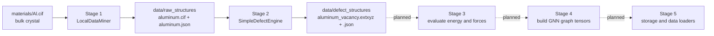

# Radiation Damage ML Pipeline

A Python pipeline that turns crystalline structures into labelled point-defect
datasets for training graph neural networks (GNNs) to predict radiation
damage.

## Why this exists

Radiation damage in structural materials is driven by point defects: vacancies
and interstitials created when energetic particles displace atoms. Predicting
how these defects form and migrate with first-principles methods is accurate
but far too slow to scan the vast space of alloys and defect configurations.

A machine-learned interatomic potential or GNN needs large, physically
consistent datasets of structures labelled with energies and forces. Those
datasets are expensive to assemble by hand. This project automates the
generation of such datasets: it takes a bulk crystal, applies controlled
defects, evaluates them, and exports graph tensors ready for training.

The long-term target system is the refractory high-entropy alloy family
W-Mo-Nb-Zr-Ti-Ta, where radiation tolerance is of direct engineering interest.

## What is implemented today

This repository is at the MVP stage. It implements the first two pipeline
steps end to end and is fully tested. It reads a local crystal structure,
builds a supercell, removes one atom to create a vacancy, and writes the
defective structure and its metadata to disk.

It does not yet compute energies or forces, and it does not yet build graphs.
Those steps are planned (see the roadmap).



## How it works

- Stage 1, data input. [`LocalDataMiner`](pipeline/stage01_data_mining.py)
  reads the configured CIF, writes a normalised copy to
  `data/raw_structures/`, and records lattice parameters, atom count, and
  formula in a JSON sidecar. A local file is used so the pipeline has no
  external service dependency.
- Stage 2, defect engineering.
  [`SimpleDefectEngine`](pipeline/stage02_defect_engineering.py) expands the
  cell into a supercell, removes one atom at a configured index, and writes an
  extended XYZ file plus a JSON sidecar to `data/defect_structures/`.
- Orchestration. [`run_pipeline.py`](run_pipeline.py) runs the stages in order
  and creates the directory tree.

All paths are anchored to the project root, so the pipeline behaves the same
regardless of the working directory, and all configuration lives in
[`pipeline/config.py`](pipeline/config.py) as dataclasses.

## Quick start

```bash
python3 -m venv .venv
. .venv/bin/activate
pip install -r requirements.txt
python run_pipeline.py
```

Expected output:

```
data/raw_structures/aluminum.cif
data/raw_structures/aluminum.json
data/defect_structures/aluminum_vacancy.extxyz
data/defect_structures/aluminum_vacancy.json
```

Change `MVPConfig.material_file` and related fields in
[`pipeline/config.py`](pipeline/config.py) to use a different material,
supercell size, or vacancy index.

## Where it is going

- V1, realistic energetics. LAMMPS with an ADP potential to produce energies
  and forces, additional defect types (divacancy, interstitial), graph
  transformation to PyTorch Geometric, and LMDB or HDF5 storage.
- V2, near-DFT accuracy. GRACE or MACE machine-learning interatomic potentials
  and Materials Project integration for bulk structures.
- V3, scale. A full defect catalogue, parallel evaluation, and streaming data
  loaders for training on large datasets.

## Strengths and limitations

Strengths:

- Minimal dependencies (numpy, ase, torch) and no external data source.
- Deterministic, project-root-anchored paths and a clear stage separation.
- 63 tests across unit, integration, and end to end layers, with static typing
  (mypy), linting (ruff), formatting (black, isort), and CI.
- Reproducible output, verified byte-for-byte for the CIF stage.

Limitations:

- One material and one defect type implemented.
- No energies, forces, or graph datasets yet.
- No continuous integration badge or published documentation site.

## Development

```bash
pip install -e ".[dev]"
pre-commit install
pytest
```

Quality gates: `ruff check .`, `mypy pipeline/`, `black .`, `isort .`, and
`pre-commit run --all-files`. CI runs these on Python 3.9, 3.10, and 3.11. See
[`benchmarks/README.md`](benchmarks/README.md) for performance and
[`tests/README.md`](tests/README.md) for the test suite.

## Further information

- [`CHANGELOG.md`](CHANGELOG.md): versioned, technical change history.
- [`tests/README.md`](tests/README.md): test layout, how to run, coverage.
- [`benchmarks/README.md`](benchmarks/README.md): performance metrics.
- [`outputs/RESULTS_DESCRIPTION.txt`](outputs/RESULTS_DESCRIPTION.txt): every
  output file and its fields.
